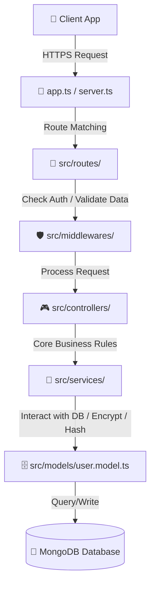

# NIBSS Wallet Backend Architecture

This document provides a comprehensive overview of the `backend` folder structure, explaining the purpose of each directory and file, and describing how they work together to form the NIBSS Wallet API.

---

## 📂 Directory Layout

```
backend/
├── ⚙️ Root Configuration Files
│   ├── .env               # Local environment secrets (ignored by git)
│   ├── .env.example       # Template for required environment variables
│   ├── eslint.config.js   # ESLint code quality rules & parser configuration
│   ├── nodemon.json       # Hot-reload configuration for development
│   ├── package.json       # Project dependencies and running scripts
│   └── tsconfig.json      # TypeScript compiler configurations (ESNext, paths)
│
└── 🛠️ src/ (Source Code)
    ├── server.ts          # Application entry point & server bootstrapper
    ├── app.ts             # Express application initialization & middleware setup
    │
    ├── 📁 config/         # Infrastructure config (e.g., database connection)
    │   └── database.ts
    │
    ├── 📁 models/         # Mongoose schemas & database business logic hooks
    │   └── user.model.ts
    │
    ├── 📁 types/          # Shared TypeScript type definitions and interfaces
    │   └── user.types.ts
    │
    ├── 📁 utils/          # Reusable helper functions (e.g., encryption utilities)
    │   └── encryption.utils.ts
    │
    ├── 📁 controllers/    # Request handlers & request/response mapping [Future implementation]
    ├── 📁 middlewares/    # Custom request filters (e.g., auth, validation) [Future implementation]
    ├── 📁 routes/         # Express endpoint routing [Future implementation]
    └── 📁 services/       # Core business logic layer [Future implementation]
```

---

## 🔍 File-by-File Breakdown

### ⚙️ Root Configuration Files

- **`package.json`**
  - **How it works:** Defines project metadata, third-party libraries (dependencies), and NPM scripts.
  - **Key scripts:**
    - `npm run dev`: Uses `nodemon` + `tsx` to run the server in development mode with hot-reloading.
    - `npm run build`: Compiles TypeScript files (`.ts`) into standard JavaScript (`.js`) inside a `/dist` folder.
    - `npm run type-check`: Validates Type safety by running the compiler without writing files (`tsc --noEmit`).
    - `npm run lint`: Analyzes the source code for styling and syntax violations using ESLint.

- **`tsconfig.json`**
  - **How it works:** Instructs the TypeScript compiler (`tsc`) on how to compile type-safe code into JavaScript. It configures compilation targets (ES2022/ESNext), source directories, strict typechecking flags, and module resolution rules (`NodeNext`).

- **`nodemon.json`**
  - **How it works:** Configures Nodemon to monitor file changes. It specifies that it should watch the `src` folder and execute TS files directly via `tsx` (TypeScript Execute) whenever a change is saved.

- **`eslint.config.js`**
  - **How it works:** Defines syntax and style-checking rules (using TypeScript ESLint plugin) to ensure consistent code patterns and block bug-prone syntax across the development team.

- **`.env` & `.env.example`**
  - **How it works:** Stores runtime secrets (database connection strings, encryption keys, tokens). `.env` contains local secrets and is never committed to Git. `.env.example` is committed to show future developers which keys must be created.

---

### 🛠️ Src/ (Source Code)

#### 🚀 Entry Points

- **[server.ts](file:///c:/Users/SMD/Documents/GitHub/nibss-wallet/backend/src/server.ts)**
  - **How it works:** The absolute starting point of the application. It loads environment variables (`dotenv.config()`), initializes the MongoDB connection, and starts the Express server listening on a specified port (default: `5000`).
- **[app.ts](file:///c:/Users/SMD/Documents/GitHub/nibss-wallet/backend/src/app.ts)**
  - **How it works:** Configures the Express framework. It setups security headers (`helmet`), enables cross-origin resource sharing (`cors`), parses incoming JSON/URL-encoded payloads, logs incoming HTTP requests (`morgan`), and registers global router endpoints.

#### 🗄️ Database & Models

- **[config/database.ts](file:///c:/Users/SMD/Documents/GitHub/nibss-wallet/backend/src/config/database.ts)**
  - **How it works:** Uses `mongoose` to create a connection to the MongoDB cluster specified by `MONGO_URI`. If the connection fails, the process is terminated safely.
- **[models/user.model.ts](file:///c:/Users/SMD/Documents/GitHub/nibss-wallet/backend/src/models/user.model.ts)**
  - **How it works:** Defines the schema and schema validators for User accounts. It houses critical document-lifecycle triggers (Mongoose pre-save hooks) and model instance methods:
    - _Pre-save triggers:_ Automatically hashes user passwords and transaction PINs using `bcryptjs`. It also encrypts highly sensitive information (NIN & BVN) before they hit the database.
    - _Instance methods:_ `comparePassword()` and `comparePin()` evaluate candidate credentials, while `getMaskedNin()` and `getMaskedBvn()` decrypt and return masked outputs (e.g. `******4829`) to protect user identity.

#### 💡 Utilities & Types

- **[utils/encryption.utils.ts](file:///c:/Users/SMD/Documents/GitHub/nibss-wallet/backend/src/utils/encryption.utils.ts)**
  - **How it works:** Provides robust, state-of-the-art cryptographic helpers for data at rest. Uses standard Node `crypto` using **AES-256-GCM** (authenticated encryption with 12-byte initialization vectors and 16-byte authentication tags) to safely encrypt/decrypt fields like BVN and NIN.
- **[types/user.types.ts](file:///c:/Users/SMD/Documents/GitHub/nibss-wallet/backend/src/types/user.types.ts)**
  - **How it works:** Provides type interfaces (`IUser`, `IKyc`, `IOnboarding`) ensuring complete type-safety between your models, controllers, and MongoDB document representations.

---

## 🌊 Request Lifecycle Flow

When a client hits an endpoint (e.g. creating a user profile), the data flows through the application architecture in the following order:



1.  **Incoming Request:** The client makes an HTTPS call to the backend.
2.  **Server Initialization:** `server.ts` routes the request through configured middleware in `app.ts`.
3.  **Routing & Middleware (Incoming):** The request goes to the matched path in `routes/`. Before hitting the controller, it runs validation and authentication checks in `middlewares/`.
4.  **Handling & Business Logic:** The `controllers/` map the request payload, pass it to the `services/` layer to handle transactional steps, and talk to `models/` (using Mongoose).
5.  **Database Operations:** The model triggers any relevant pre-save functions (encrypting fields like NIN, hashing passwords) and securely writes to MongoDB.
6.  **Response:** The result flows back up to the controller which sends the response back to the client.
