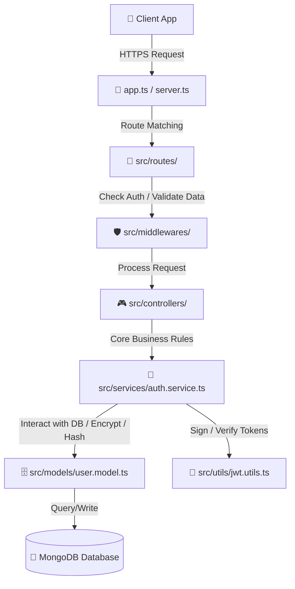

# NIBSS Wallet Backend Architecture

This document provides a comprehensive overview of the `backend` folder structure, explaining the purpose of each directory and file, and describing how they work together to form the NIBSS Wallet API.

---

## 📂 Directory Layout

```
backend/
├── ⚙️ Root Configuration Files
│   ├── .env               # Local environment secrets (ignored by git)
│   ├── .env.example       # Template for required environment variables
│   ├── eslint.config.js   # ESLint code quality rules & parser configuration
│   ├── nodemon.json       # Hot-reload configuration for development
│   ├── package.json       # Project dependencies and running scripts
│   └── tsconfig.json      # TypeScript compiler configurations (ESNext, paths)
│
└── 🛠️ src/ (Source Code)
    ├── server.ts          # Application entry point & server bootstrapper
    ├── app.ts             # Express application initialization & middleware setup
    │
    ├── 📁 config/         # Infrastructure config (e.g., database connection)
    │   └── database.ts
    │
    ├── 📁 models/         # Mongoose schemas & database business logic hooks
    │   └── user.model.ts
    │
    ├── 📁 types/          # Shared TypeScript type definitions and interfaces
    │   └── user.types.ts
    │
    ├── 📁 utils/          # Reusable helper functions
    │   ├── encryption.utils.ts
    │   └── jwt.utils.ts
    │
    ├── 📁 services/       # Core business logic layer
    │   └── auth.service.ts
    │
    ├── 📁 controllers/    # Request handlers & request/response mapping [Pending]
    ├── 📁 middlewares/    # Custom request filters (e.g., auth, validation) [Pending]
    └── 📁 routes/         # Express endpoint routing [Pending]
```

---

## 🔍 File-by-File Breakdown

### ⚙️ Root Configuration Files

- **`package.json`**
  - **How it works:** Defines project metadata, third-party libraries (dependencies), and NPM scripts.
  - **Key scripts:**
    - `npm run dev`: Uses `nodemon` + `tsx` to run the server in development mode with hot-reloading.
    - `npm run build`: Compiles TypeScript files (`.ts`) into standard JavaScript (`.js`) inside a `/dist` folder.
    - `npm run type-check`: Validates type safety by running the compiler without writing files (`tsc --noEmit`).
    - `npm run lint`: Analyzes the source code for styling and syntax violations using ESLint.

- **`tsconfig.json`**
  - **How it works:** Instructs the TypeScript compiler (`tsc`) on how to compile type-safe code into JavaScript. It configures compilation targets (ES2022/ESNext), source directories, strict typechecking flags, and module resolution rules (`NodeNext`).

- **`nodemon.json`**
  - **How it works:** Configures Nodemon to monitor file changes. It specifies that it should watch the `src` folder and execute TS files directly via `tsx` (TypeScript Execute) whenever a change is saved.

- **`eslint.config.js`**
  - **How it works:** Defines syntax and style-checking rules (using TypeScript ESLint plugin) to ensure consistent code patterns and block bug-prone syntax across the development team.

- **`.env` & `.env.example`**
  - **How it works:** Stores runtime secrets (database connection strings, encryption keys, JWT secrets). `.env` contains local secrets and is never committed to Git. `.env.example` is committed to show future developers which keys must be created.
  - **Required keys:** `MONGO_URI`, `JWT_ACCESS_SECRET`, `JWT_REFRESH_SECRET`, `JWT_ACCESS_EXPIRES_IN`, `JWT_REFRESH_EXPIRES_IN`, `ENCRYPTION_KEY`

---

### 🛠️ Src/ (Source Code)

#### 🚀 Entry Points

- **[server.ts](file:///c:/Users/SMD/Documents/GitHub/nibss-wallet/backend/src/server.ts)**
  - **How it works:** The absolute starting point of the application. It loads environment variables (`dotenv.config()`), initializes the MongoDB connection, and starts the Express server listening on a specified port (default: `5000`).

- **[app.ts](file:///c:/Users/SMD/Documents/GitHub/nibss-wallet/backend/src/app.ts)**
  - **How it works:** Configures the Express framework. Sets up security headers (`helmet`), enables cross-origin resource sharing (`cors`), parses incoming JSON/URL-encoded payloads, logs incoming HTTP requests (`morgan`), and registers global router endpoints.

---

#### 🗄️ Database & Models

- **[config/database.ts](file:///c:/Users/SMD/Documents/GitHub/nibss-wallet/backend/src/config/database.ts)**
  - **How it works:** Uses `mongoose` to create a connection to the MongoDB cluster specified by `MONGO_URI`. If the connection fails, the process is terminated safely.

- **[models/user.model.ts](file:///c:/Users/SMD/Documents/GitHub/nibss-wallet/backend/src/models/user.model.ts)**
  - **How it works:** Defines the schema and validators for User accounts. It houses critical document-lifecycle triggers (Mongoose pre-save hooks) and model instance methods:
    - _Pre-save triggers:_ Automatically hashes user passwords and transaction PINs using `bcryptjs`. Encrypts sensitive fields (NIN & BVN) before they are written to the database.
    - _Instance methods:_ `comparePassword()` and `comparePin()` safely evaluate candidate credentials against hashed values. `getMaskedNin()` and `getMaskedBvn()` decrypt and return masked outputs (e.g. `*******4829`) to protect user identity.

---

#### 💡 Utilities

- **[utils/encryption.utils.ts](file:///c:/Users/SMD/Documents/GitHub/nibss-wallet/backend/src/utils/encryption.utils.ts)**
  - **How it works:** Provides cryptographic helpers for data at rest. Uses Node's `crypto` module with **AES-256-GCM** (authenticated encryption with 12-byte IVs and 16-byte auth tags) to safely encrypt and decrypt sensitive fields like BVN and NIN.

- **[utils/jwt.utils.ts](file:///c:/Users/SMD/Documents/GitHub/nibss-wallet/backend/src/utils/jwt.utils.ts)**
  - **How it works:** Manages all JSON Web Token operations. Exposes:
    - `generateAccessToken()` — short-lived token (default: 15 minutes) signed with `JWT_ACCESS_SECRET`.
    - `generateRefreshToken()` — long-lived token (default: 7 days) signed with `JWT_REFRESH_SECRET`.
    - `generateTokenPair()` — convenience wrapper that returns both tokens at once.
    - `verifyAccessToken()` — validates and decodes an access token; throws if expired or tampered.
    - `verifyRefreshToken()` — validates and decodes a refresh token; throws if expired or tampered.

---

#### 🧠 Services

- **[services/auth.service.ts](file:///c:/Users/SMD/Documents/GitHub/nibss-wallet/backend/src/services/auth.service.ts)**
  - **How it works:** Contains the core authentication business logic. Exposes three service functions:
    - `registerUser(input)` — checks for duplicate email/phone, creates the user (password is auto-hashed by the pre-save hook), and returns a JWT token pair.
    - `loginUser(input)` — fetches the user by email (including the password field), verifies account status, validates the password via `comparePassword()`, updates `lastLogin`, and returns a JWT token pair.
    - `refreshUserToken(refreshToken)` — **verifies the refresh token cryptographically** first (throws if expired/invalid), looks up the user from the decoded payload, checks account status, and issues a fresh token pair.

---

#### 📁 Pending Implementation

- **`controllers/`** — Will map HTTP requests/responses and delegate business logic to the service layer.
- **`middlewares/`** — Will house authentication guards (`verifyAccessToken`) and request validation middleware.
- **`routes/`** — Will define Express router endpoints and bind them to the appropriate controllers.

---

## 🌊 Request Lifecycle Flow

When a client hits an endpoint (e.g. logging in), the data flows through the application in the following order:



1. **Incoming Request:** The client makes an HTTPS call to the backend.
2. **Server Initialization:** `server.ts` routes the request through configured middleware in `app.ts`.
3. **Routing & Middleware:** The request matches a path in `routes/`. Before hitting the controller, it passes through `middlewares/` for auth verification and input validation.
4. **Controller:** Maps the request payload and delegates to the `services/` layer.
5. **Service:** Executes business logic — credential checks, token generation via `jwt.utils.ts`, and interaction with the `models/` layer.
6. **Database Operations:** The model triggers pre-save hooks (encrypting NIN/BVN, hashing passwords/PINs) and writes securely to MongoDB.
7. **Response:** The result flows back up to the controller which sends the structured response to the client.
