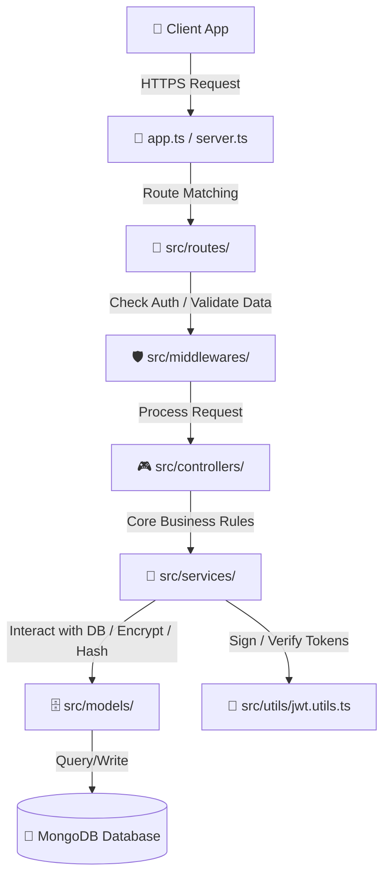

# NIBSS Wallet Backend Architecture

This document provides a comprehensive overview of the `backend` folder structure, explaining the purpose of each directory and file, and describing how they work together to form the NIBSS Wallet API.

---

## 📂 Directory Layout

```
backend/
├── ⚙️ Root Configuration Files
│   ├── .env               # Local environment secrets (ignored by git)
│   ├── .env.example       # Template for required environment variables
│   ├── eslint.config.js   # ESLint code quality rules & parser configuration
│   ├── nodemon.json       # Hot-reload configuration for development
│   ├── package.json       # Project dependencies and running scripts
│   └── tsconfig.json      # TypeScript compiler configurations (ESNext, paths)
│
└── 🛠️ src/ (Source Code)
    ├── server.ts          # Application entry point & server bootstrapper
    ├── app.ts             # Express application initialization & middleware setup
    │
    ├── 📁 config/
    │   └── database.ts    # Mongoose MongoDB connection
    │
    ├── 📁 models/
    │   ├── user.model.ts  # User schema, pre-save hooks (hashing, encryption), instance methods
    │   └── wallet.model.ts# Wallet schema with balance, currency & daily limit tracking
    │
    ├── 📁 types/
    │   ├── user.types.ts  # IUser interface & related types
    │   └── wallet.types.ts# IWallet interface & related types
    │
    ├── 📁 utils/
    │   ├── AppError.ts         # Custom operational error class
    │   ├── encryption.utils.ts # AES-256-GCM encrypt/decrypt helpers
    │   └── jwt.utils.ts        # Token generation & verification
    │
    ├── 📁 services/
    │   ├── auth.service.ts    # Register, login, refresh token logic
    │   ├── user.service.ts    # Get profile, update profile, change password
    │   └── wallet.service.ts  # Get wallet, get balance, daily limit check
    │
    ├── 📁 controllers/
    │   ├── auth.controller.ts    # Handles /auth/* HTTP requests
    │   ├── user.controller.ts    # Handles /users/* HTTP requests
    │   └── wallet.controller.ts  # Handles /wallet/* HTTP requests
    │
    ├── 📁 middlewares/
    │   ├── auth.middleware.ts     # JWT protect guard
    │   ├── error.middleware.ts    # Global error handler
    │   ├── validate.middleware.ts # express-validator result runner
    │   └── validators/
    │       ├── auth.validator.ts  # register & login validation rules
    │       └── user.validator.ts  # updateProfile & changePassword rules
    │
    ├── 📁 routes/
    │   ├── auth.routes.ts    # POST /auth/register|login|logout|refresh-token
    │   ├── user.routes.ts    # GET|PATCH /users/me, PATCH /users/me/change-password
    │   └── wallet.routes.ts  # GET /wallet, GET /wallet/balance
    │
    └── 📁 __tests__/
        ├── auth.test.ts  # Auth integration tests (register, login, refresh)
        └── setup.ts      # MongoDB Memory Server setup & teardown
```

---

## 🔍 File-by-File Breakdown

### ⚙️ Root Configuration Files

- **`package.json`**
  - **How it works:** Defines project metadata, third-party libraries (dependencies), and NPM scripts.
  - **Key scripts:**
    - `npm run dev`: Uses `nodemon` + `tsx` to run the server in development mode with hot-reloading.
    - `npm run build`: Compiles TypeScript files (`.ts`) into standard JavaScript (`.js`) inside a `/dist` folder.
    - `npm run type-check`: Validates type safety by running the compiler without writing files (`tsc --noEmit`).
    - `npm run lint`: Analyzes the source code for styling and syntax violations using ESLint.
    - `npm test`: Runs Jest integration tests.

- **`tsconfig.json`**
  - **How it works:** Instructs the TypeScript compiler (`tsc`) on how to compile type-safe code into JavaScript. It configures compilation targets (ES2022/ESNext), source directories, strict typechecking flags, and module resolution rules (`NodeNext`).

- **`nodemon.json`**
  - **How it works:** Configures Nodemon to monitor file changes. It specifies that it should watch the `src` folder and execute TS files directly via `tsx` (TypeScript Execute) whenever a change is saved.

- **`eslint.config.js`**
  - **How it works:** Defines syntax and style-checking rules (using TypeScript ESLint plugin) to ensure consistent code patterns and block bug-prone syntax across the development team.

- **`.env` & `.env.example`**
  - **How it works:** Stores runtime secrets (database connection strings, encryption keys, JWT secrets). `.env` contains local secrets and is never committed to Git. `.env.example` is committed to show future developers which keys must be created.
  - **Required keys:** `MONGO_URI`, `JWT_ACCESS_SECRET`, `JWT_REFRESH_SECRET`, `JWT_ACCESS_EXPIRES_IN`, `JWT_REFRESH_EXPIRES_IN`, `ENCRYPTION_KEY`, `FRONTEND_URL`

---

### 🛠️ Src/ (Source Code)

#### 🚀 Entry Points

- **[server.ts](file:///c:/Users/SMD/Documents/GitHub/nibss-wallet/backend/src/server.ts)**
  - **How it works:** The absolute starting point of the application. It loads environment variables (`dotenv.config()`), initializes the MongoDB connection, and starts the Express server listening on a specified port (default: `5000`).

- **[app.ts](file:///c:/Users/SMD/Documents/GitHub/nibss-wallet/backend/src/app.ts)**
  - **How it works:** Configures the Express framework. Sets up security headers (`helmet`), enables cross-origin resource sharing (`cors`), parses incoming JSON/URL-encoded payloads, logs incoming HTTP requests (`morgan`), and registers global router endpoints (`/api/v1/auth`, `/api/v1/users`, `/api/v1/wallet`).

---

#### 🗄️ Database & Models

- **[config/database.ts](file:///c:/Users/SMD/Documents/GitHub/nibss-wallet/backend/src/config/database.ts)**
  - **How it works:** Uses `mongoose` to create a connection to the MongoDB cluster specified by `MONGO_URI`. If the connection fails, the process is terminated safely.

- **[models/user.model.ts](file:///c:/Users/SMD/Documents/GitHub/nibss-wallet/backend/src/models/user.model.ts)**
  - **How it works:** Defines the schema and validators for User accounts. It houses critical document-lifecycle triggers (Mongoose pre-save hooks) and model instance methods:
    - _Pre-save triggers:_ Automatically hashes user passwords and transaction PINs using `bcryptjs`. Encrypts sensitive fields (NIN & BVN) before they are written to the database.
    - _Instance methods:_ `comparePassword()` and `comparePin()` safely evaluate candidate credentials against hashed values. `getMaskedNin()` and `getMaskedBvn()` decrypt and return masked outputs (e.g. `*******4829`) to protect user identity.

- **[models/wallet.model.ts](file:///c:/Users/SMD/Documents/GitHub/nibss-wallet/backend/src/models/wallet.model.ts)**
  - **How it works:** Defines the schema for a user's NGN wallet. Tracks balance, wallet status (`active` | `frozen` | `suspended`), daily transfer limit (Tier 1: ₦50,000), daily transfer used, and last reset date. One wallet per user enforced via a unique index on `userId`.

---

#### 💡 Utilities

- **[utils/AppError.ts](file:///c:/Users/SMD/Documents/GitHub/nibss-wallet/backend/src/utils/AppError.ts)**
  - **How it works:** A custom error class that extends `Error`. Adds a `statusCode` and `isOperational` flag so the global error handler can distinguish between known operational errors (e.g. 404 Not Found) and unexpected programming errors.

- **[utils/encryption.utils.ts](file:///c:/Users/SMD/Documents/GitHub/nibss-wallet/backend/src/utils/encryption.utils.ts)**
  - **How it works:** Provides cryptographic helpers for data at rest. Uses Node's `crypto` module with **AES-256-GCM** (authenticated encryption with 12-byte IVs and 16-byte auth tags) to safely encrypt and decrypt sensitive fields like BVN and NIN.

- **[utils/jwt.utils.ts](file:///c:/Users/SMD/Documents/GitHub/nibss-wallet/backend/src/utils/jwt.utils.ts)**
  - **How it works:** Manages all JSON Web Token operations. Exposes:
    - `generateAccessToken()` — short-lived token (default: 15 minutes) signed with `JWT_ACCESS_SECRET`.
    - `generateRefreshToken()` — long-lived token (default: 7 days) signed with `JWT_REFRESH_SECRET`.
    - `generateTokenPair()` — convenience wrapper that returns both tokens at once.
    - `verifyAccessToken()` — validates and decodes an access token; throws if expired or tampered.
    - `verifyRefreshToken()` — validates and decodes a refresh token; throws if expired or tampered.

---

#### 🧠 Services

- **[services/auth.service.ts](file:///c:/Users/SMD/Documents/GitHub/nibss-wallet/backend/src/services/auth.service.ts)**
  - **How it works:** Contains the core authentication business logic:
    - `registerUser(input)` — checks for duplicate email/phone, creates the user, auto-provisions a wallet (NGN, ₦1,000,000 starting balance, ₦50,000 daily limit), and returns a JWT token pair.
    - `loginUser(input)` — fetches the user by email, verifies account status, validates the password via `comparePassword()`, updates `lastLogin`, and returns a JWT token pair.
    - `refreshUserToken(refreshToken)` — **verifies the refresh token cryptographically** first (throws if expired/invalid), looks up the user from the decoded payload, checks account status, and issues a fresh token pair.

- **[services/user.service.ts](file:///c:/Users/SMD/Documents/GitHub/nibss-wallet/backend/src/services/user.service.ts)**
  - **How it works:** Handles user profile operations:
    - `getCurrentUser(userId)` — fetches the authenticated user by ID.
    - `updateProfile(userId, input)` — updates name/phone (with duplicate phone check), marks the `profile` step in onboarding as complete.
    - `changePassword(userId, input)` — verifies the current password, prevents reusing the same password, and updates it (auto-re-hashed by pre-save hook).

- **[services/wallet.service.ts](file:///c:/Users/SMD/Documents/GitHub/nibss-wallet/backend/src/services/wallet.service.ts)**
  - **How it works:** Handles wallet operations:
    - `getWallet(userId)` — returns the full wallet document.
    - `getWalletBalance(userId)` — returns balance, currency, status, and daily limit info (only for active wallets).
    - `checkDailyLimit(userId, amount)` — resets `dailyTransferUsed` on a new calendar day, then throws if the requested transfer would exceed the daily limit.

---

#### 🎮 Controllers

- **[controllers/auth.controller.ts](file:///c:/Users/SMD/Documents/GitHub/nibss-wallet/backend/src/controllers/auth.controller.ts)** — Handles `register`, `login`, `logout`, and `refreshToken` HTTP actions.
- **[controllers/user.controller.ts](file:///c:/Users/SMD/Documents/GitHub/nibss-wallet/backend/src/controllers/user.controller.ts)** — Handles `getMe`, `updateMe`, and `updatePassword` HTTP actions.
- **[controllers/wallet.controller.ts](file:///c:/Users/SMD/Documents/GitHub/nibss-wallet/backend/src/controllers/wallet.controller.ts)** — Handles `getMyWallet` and `getBalance` HTTP actions.

---

#### 🛡️ Middlewares

- **[middlewares/auth.middleware.ts](file:///c:/Users/SMD/Documents/GitHub/nibss-wallet/backend/src/middlewares/auth.middleware.ts)**
  - **How it works:** `protect` middleware extracts and verifies the access token (from cookie or `Authorization` header), attaches the decoded user to `req.user`, and gates all protected routes.

- **[middlewares/error.middleware.ts](file:///c:/Users/SMD/Documents/GitHub/nibss-wallet/backend/src/middlewares/error.middleware.ts)**
  - **How it works:** Global Express error handler. Distinguishes between operational `AppError` instances and unexpected errors, formats consistent JSON error responses, and masks internal errors in production.

- **[middlewares/validate.middleware.ts](file:///c:/Users/SMD/Documents/GitHub/nibss-wallet/backend/src/middlewares/validate.middleware.ts)**
  - **How it works:** Reads validation results from `express-validator` and short-circuits with a `422 Unprocessable Entity` response if any field fails validation.

- **[middlewares/validators/auth.validator.ts](file:///c:/Users/SMD/Documents/GitHub/nibss-wallet/backend/src/middlewares/validators/auth.validator.ts)** — Validation chains for `register` (firstName, lastName, email, phone, password) and `login` (email, password).
- **[middlewares/validators/user.validator.ts](file:///c:/Users/SMD/Documents/GitHub/nibss-wallet/backend/src/middlewares/validators/user.validator.ts)** — Validation chains for `updateProfile` and `changePassword`.

---

#### 📍 Routes

| Router | Prefix | Endpoints |
|--------|--------|-----------|
| `auth.routes.ts` | `/api/v1/auth` | `POST /register`, `POST /login`, `POST /logout`, `POST /refresh-token` |
| `user.routes.ts` | `/api/v1/users` | `GET /me`, `PATCH /me`, `PATCH /me/change-password` |
| `wallet.routes.ts` | `/api/v1/wallet` | `GET /`, `GET /balance` |

---

#### 🧪 Tests

- **[__tests__/auth.test.ts](file:///c:/Users/SMD/Documents/GitHub/nibss-wallet/backend/src/__tests__/auth.test.ts)**
  - Integration tests for the auth flow using Supertest. Covers: successful registration (with wallet provisioning), duplicate email/phone rejection, successful login, invalid credential handling, and token refresh.

- **[__tests__/setup.ts](file:///c:/Users/SMD/Documents/GitHub/nibss-wallet/backend/src/__tests__/setup.ts)**
  - Starts an in-memory MongoDB server before all tests and tears it down afterwards — no external database required.

---

## 🌊 Request Lifecycle Flow

When a client hits an endpoint (e.g. logging in), the data flows through the application in the following order:


```mermaid
graph TD
    Client[📱 Client App] -->|HTTPS Request| Express[🚀 app.ts / server.ts]
    Express -->|Route Matching| Router[📍 src/routes/]
    Router -->|Check Auth / Validate Data| Middleware[🛡️ src/middlewares/]
    Middleware -->|Process Request| Controller[🎮 src/controllers/]
    Controller -->|Core Business Rules| Service[🧠 src/services/]
    Service -->|Interact with DB / Encrypt / Hash| Model[🗄️ src/models/]
    Service -->|Sign / Verify Tokens| JWT[🔑 src/utils/jwt.utils.ts]
    Model -->|Query/Write| MongoDB[(🍃 MongoDB Database)]
```

1. **Incoming Request:** The client makes an HTTPS call to the backend.
2. **Server Initialization:** `server.ts` routes the request through configured middleware in `app.ts`.
3. **Routing & Middleware:** The request matches a path in `routes/`. Before hitting the controller, it passes through `middlewares/` for auth verification and input validation.
4. **Controller:** Maps the request payload and delegates to the `services/` layer.
5. **Service:** Executes business logic — credential checks, token generation via `jwt.utils.ts`, and interaction with the `models/` layer.
6. **Database Operations:** The model triggers pre-save hooks (encrypting NIN/BVN, hashing passwords/PINs) and writes securely to MongoDB.
7. **Response:** The result flows back up to the controller which sends the structured response to the client.
